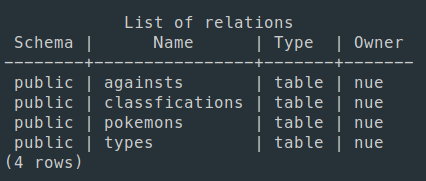

# PkmDatabase in PostgreSQL with python

## RESUME

This repository create a pokemon database with all stats for each pokemon until 7 generation. In the data directory is stored the csv files that contains all data about pokemos, the csv files are:

1. abilities.csv
2. againsts.csv
3. classfications.csv
4. pokemons.csv
5. types.csv

These csv files where created in the ***PkmDataBase.ipynb***, check the file to know how where created.

## Tables created in PostgreSQL

The ***createTablesPkm.sql*** create the tables in a database named pokemonDB, the next imagen show the tables created in PostgresSQL. To use the file, you need to use the command line and put this:

``` bash
psql -U user -h localhost -d pokemondb -f createTablesPkm.sql
```

you need to put the password for the user and then the tables will be created in the pokemosDB database. To view the created tables use this from the command line:

```bash
psql -U user -h localhost -d pokemondb -c "\dt"
```



## Create&Load script

The ***create&load.sh*** is a script that automatic creates the tables in the database an then populate the tables with all csv in the data directory. To use this script put the following command from the command line:

```bash
bash create\&load.sh
```

## Data Visualization

The ***PkmDataVisualization.ipynb*** file has many visualizations from de pokemon.csv.
